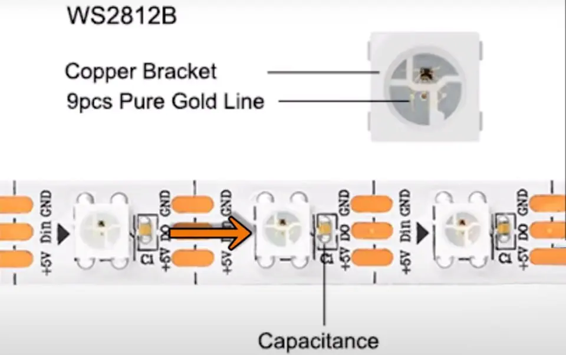

# Projeto da Matéria de Computação Física e Aplicações - ACH2157

## Descrição

Muitas vezes quando um motociclista necessita realizar uma curva, a seta sinalizadora da moto geralmente não fica razoalvemente visível para os outros condutores. No caso dos ciclistas, nem há uma seta sinalizadora.

Por isso fizemos um colete com setas sinalizadoras para os ciclistas e motociclistas, com o intuito de melhorar a visibilidade deles nas vias.

### Lista de Materiais

| Quantidade | Nome | Link para referência |
| --- | --- | --- |
| 1 | ESP32-WROOM-32 Devkit V1 | https://www.espressif.com/sites/default/files/documentation/esp32-wroom-32_datasheet_en.pdf |
| 1 | fitas de LEDs endereçáveis (addressable RGB, aRGB) | https://a.aliexpress.com/_mLhYtMw |
| 1 | Módulo RF YK04 | https://www.faranux.com/product/4-channels-rf-remote-control-module-yk04/ |
| 1 | Sensor de Som Modelo MicNakano | https://github.com/FNakano/CFA/tree/master/projetos/sensorDeSom |
| X | Jumpers variados | --- |
| 2 | Power banks | --- |

Obs: Utilizamos 2 power banks, um para o ESP32 e outro para os LEDs, pois com apenas um os LEDs aRGBs estavam roubando muita energia e o ESP ficou instável)

ESP32:


Sensor de som modelo MicNakano:


Pinos:

| Sensor de som | comentário | Jumper
| --- | --- | --- |
| 1 (mais distante do microfone) | VIN 3.3V | Verde
| 2 | Saída | Vinho
| 3 | GND | Cinza

Módulo RF YK04: 


Pinos:

| Sensor de som | comentário | Jumper
| --- | --- | --- |
| GND | GND | Cinza
| 5V | 5V | Laranja
| D0 | Saída 1 | Lilás
| D1 | Saída 2 | Marrom
| D2 | Saída 3 | ---
| D3 | Saída 4 | ---
| VT | Emite sinal se apertar qualquer botão do controle | ---

### Conexões

https://docs.google.com/spreadsheets/d/1dG1MfTy3x1gHLY0yxJIRdy7Aiv9Ak8zw/edit?usp=sharing&ouid=111602521034713673280&rtpof=true&sd=true

**Nota**: Vale ressaltar que o GND da fita de LEDs tem que estar junto com o GND do ESP32, se não as cores da fita não irão funcinar corretamente.

**Nota 2**: Na versão final do nosso produto removemos a protoboard, realizando as conexões diretamente.

## Como montar o dispositivo físico

Fazer as conexões listadas, transferir o código `sketch_oct14a.ino` para o ESP32 via Arduino IDE, e ligar o ESP32 e os LEDs com os power banks.

## Arquitetura e organização

Apenas feito em puro C++. Optamos por essa linguagem pois tinha mais exemplos em C++ do que em Python.

Para piscar uma luz é necessário utilizar a função `delay`, porém a utilização dessa função bloqueia a iteração da função principal loop, impedindo assim a execução simultânea do RF e do microfone. A solução foi se basear num sistema de tempo real, utilizando uma variável que marca o tempo em que o led foi aceso, e depois de X segundos passados, irá desligar, sem parar a execução do loop.

Para controlar a fita de LEDs, optamos por utilizar a biblioteca `FastLED.h` e dividindo a fita de led principal em duas partes: direita e esqueda.

## Como usar o programa

Como nosso projeto não tem nenhum interface gráfica, como por exemplo um web server, basta somente ligar o ESP32 e os LEDs nos power banks para o programa já executar.

## Como os LEDs endereçáveis funcionam?

Ao contrário de um LED RGB comum, os LEDs endereçáveis possuem um microcontrolador em cada célula que é responsável por acencer os LEDs de cada cor (vermelho, verde e azul em cada célula) e os comandos que enviamos para cada microcontrolador é feito por apenas um fio, que é o Din.



No caso do LED que utilizamos, possui o controlador WS2812B, que é o maior retângulo escuro na imagem abaixo.


Imagem mostrando o acionamento de cada led individualmente:


Para mais detalhes, acesse o link https://blog.eletrogate.com/leds-enderecaveis-conhecendo-o-ws2812b/

## Como enviar comandos para os LEDs

Para enviar os comandos para os LEDs, utilizamos a biblioteca `FastLED.h` e instanciamos os leds dessa forma:

```c++
CRGB leds[NUM_LEDS];
FastLED.addLeds<NEOPIXEL, DATA_PIN>(leds, NUM_LEDS);
```

Obs: Para dividirmos a fita de LED principal em duas partes, declaramos também a segunda metade da fita com o seguinte código:

```c++
CRGB leds2[NUM_LEDS2];
FastLED.addLeds<NEOPIXEL, DATA_PIN>(leds2, NUM_LEDS2);
```

A variável `NUM_LEDS` é a quantidade de leds que possui na fita e o `DATA_PIN` é o pino do ESP em que o Din do led está conectado. O `NEOPIXEL` é o tipo da controladora que iremos trabalhar, pois o WS2812B é um controlador do tipo NeoPixel (https://www.digikey.ca/en/maker/projects/adafruit-neopixel-berguide/970445a726c1438a9023c1e78c42e0bb#:~:text=%E2%80%9CNeoPixel%E2%80%9D%20is%20Adafruit's%20brand%20for,a%20single%2Dwire%20control%20protocol.).

Porém para ligar de fato os leds, temos que primeiro definir as cores, que no trecho abaixo está dentro do `for`, para definir as cores de cada célula, e em seguida dar um `show()` para atualizar as cores de todas as células.

```c++
for (int cur = i; cur < j; cur++) {
    leds[cur] = CRGB(r, g, b);
}

FastLED.show();
```

## Como o programa foi feito

Apenas um ponto que vale explicar no código é a função `led`. Ela irá fazer a fita led principal piscar. A quantidade de iterações que os leds ficarão piscando será determinado na variável `iterations` dentro da função `loop()`. Por exemplo, se o botão da direita for pressionado, esse trecho de código irá setar o `RFMillisOn1` com o número de iterações definida globalmente.

```c++
if(digitalRead(RFRight) > 0) {
    RFMillisOn1 = iterations;
}
```

Abaixo segue o código comentado da função `led()`:

```c++
void led(int side, int state) { // Side: 0 = Right, 1 = Left. State: HIGH = On, LOW = Off
  byte i, j, r, g, b;

  if (side == 0) {
    i = 0; // Beginning of the strip
    j = NUM_LEDS / 2; // Half of the strip

    if (state == HIGH) {
      r = 255;
      g = 45;
      b = 0;

      RFLedState1 == HIGH;
    } else {
      r = 0;
      g = 0;
      b = 0;

      RFLedState1 == LOW;
    }
  } else {
    i = NUM_LEDS / 2; // Half of the strip
    j = NUM_LEDS; // End of the strip

    if (state == HIGH) {
      r = 255;
      g = 45;
      b = 0;

      RFLedState2 == HIGH;
    } else {
      r = 0;
      g = 0;
      b = 0;

      RFLedState2 == LOW;
    }
  }

  for (int cur = i; cur < j; cur++) {
    leds[cur] = CRGB(r, g, b);
  }

  FastLED.show();
}
```

Para piscar o led do microfone, é utilizado a função `ledMic()` que é exatamente a mesma função anterior, porém sem o parâmetro `side`.

## Vídeo do produto

https://photos.app.goo.gl/zqSEsEeRtrnoj7mz9

## Referências

https://www.esp32.com/viewtopic.php?t=11904
https://docs.arduino.cc/built-in-examples/digital/BlinkWithoutDelay
https://create.arduino.cc/projecthub/talofer99/arduino-and-addressable-led-b8403f
https://github.com/FNakano/CFA/tree/master/projetos/sensorDeSom
https://blog.eletrogate.com/leds-enderecaveis-conhecendo-o-ws2812b/
https://www.derunledlights.com/pt/the-difference-between-addressable-rgb-led-strip-ws2811-ws2812b-ws2813-ws2815-sk6812-sk9822/
https://www.digikey.ca/en/maker/projects/adafruit-neopixel-berguide/970445a726c1438a9023c1e78c42e0bb#:~:text=%E2%80%9CNeoPixel%E2%80%9D%20is%20Adafruit's%20brand%20for,a%20single%2Dwire%20control%20protocol.