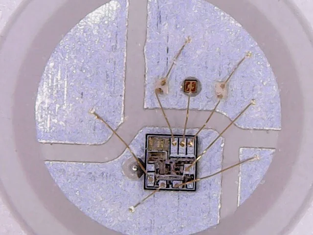
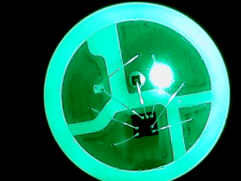

# Projeto da Matéria de Computação Física e Aplicações - ACH2157

## Descrição

Muitas vezes quando um motociclista necessita realizar uma curva, a seta sinalizadora da moto geralmente não fica razoalvemente visível para os outros condutores. No caso dos ciclistas, nem há uma seta sinalizadora.

Por isso fizemos um colete com setas sinalizadoras para os ciclistas e motociclistas, com o intuito de melhorar a visibilidade deles nas vias.

### Lista de Materiais

| Quantidade | Nome | Link para referência |
| --- | --- | --- |
| 1 | ESP32-WROOM-32 Devkit V1 | https://www.espressif.com/sites/default/files/documentation/esp32-wroom-32_datasheet_en.pdf |
| 1 | fitas de LEDs endereçáveis (addressable RGB, aRGB) | https://a.aliexpress.com/_mLhYtMw |
| 1 | Módulo RF YK04 | https://www.faranux.com/product/4-channels-rf-remote-control-module-yk04/ |
| 1 | Sensor de Som Modelo MicNakano | https://github.com/FNakano/CFA/tree/master/projetos/sensorDeSom |
| X | Jumpers variados | --- |
| 2 | Power banks | --- |

Obs: Utilizamos 2 power banks, um para o ESP32 e outro para os LEDs, pois com apenas um os LEDs aRGBs estavam roubando muita energia e o ESP ficou instável)

ESP32:


Sensor de som modelo MicNakano:


Pinos:

| Sensor de som | comentário | Jumper
| --- | --- | --- |
| 1 (mais distante do microfone) | VIN 3.3V | Verde
| 2 | Saída | Vinho
| 3 | GND | Cinza

Módulo RF YK04: 


Pinos:

| Sensor de som | comentário | Jumper
| --- | --- | --- |
| GND | GND | Cinza
| 5V | 5V | Laranja
| D0 | Saída 1 | Lilás
| D1 | Saída 2 | Marrom
| D2 | Saída 3 | ---
| D3 | Saída 4 | ---
| VT | Emite sinal se apertar qualquer botão do controle | ---

### Conexões

https://docs.google.com/spreadsheets/d/1dG1MfTy3x1gHLY0yxJIRdy7Aiv9Ak8zw/edit?usp=sharing&ouid=111602521034713673280&rtpof=true&sd=true

**Nota**: Vale ressaltar que o GND da fita de LEDs tem que estar junto com o GND do ESP32, se não as cores da fita não irão funcinar corretamente.

## Como montar o dispositivo físico

Fazer as conexões listadas, transferir o código `sketch_oct14a.ino` para o ESP32 via Arduino IDE, e ligar o ESP32 e os LEDs com os power banks.

## Arquitetura e organização

Apenas feito em puro C++. Optamos por essa linguagem pois tinha mais exemplos em C++ do que em Python.

Para piscar uma luz é necessário utilizar a função `delay`, porém a utilização dessa função bloqueia a iteração da função principal loop, impedindo assim a execução simultânea do RF e do microfone. A solução foi se basear num sistema de tempo real, utilizando uma variável que marca o tempo em que o led foi aceso, e depois de X segundos passados, irá desligar, sem parar a execução do loop.

Para controlar a fita de LEDs, optamos por utilizar a biblioteca `FastLED.h` e dividindo a fita de led principal em duas partes: direita e esqueda.

## Como usar o programa

Como nosso projeto não tem nenhum interface gráfica, como por exemplo um web server, basta somente ligar o ESP32 e os LEDs nos power banks para o programa já executar.

## Como os LEDs endereçáveis funcionam?

Ao contrário de um LED RGB comum, os LEDs endereçáveis possuem um microcontrolador em cada led. No caso do LED que utilizamos, possui o controlador WS2812b






## Como enviar comandos para os LEDs

O ESP32 tem geradores PWM com frequência e ciclo de carga (*duty-cycle*) ajustáveis. O ciclo de carga é codificado como um inteiro entre 0 e 1023, que correspode (linearmente) ao ciclo de carga de zero até 100%. Como o motor responde a um sinal de duração de 1-2ms, o comando do ESP vai de aprox. 50-100.

Para usá-los com Micropython, digitando o programa abaixo, o servo é colocado em um ângulo perto de zero. `motor.duty()` pode ser executados com outros valores, por exemplo, 60, 100, 120, para diferentes ângulos.


## Como o programa foi feito

```python
p25 = Pin(25, Pin.OUT)
motor = PWM(p25, freq=50)
motor.duty(40)
```
Fonte: https://docs.micropython.org/en/latest/esp8266/tutorial/pwm.html#control-a-hobby-servo

```python
s.bind(('', 3000))   # bind to port 3000 https://docs.micropython.org/en/latest/library/socket.html#socket.socket.bind
s.listen(2)  # allow for 2 connection before refusing https://docs.micropython.org/en/latest/library/socket.html#socket.socket.listen
```

Uma requisição GET é feita (pelo navegador) concatenando, à URL (que endereça a requisição para o servidor), os parâmetros, no formato `?<id>=<valor>` no texto da requisição.

```python
    request = conn.recv(1024)  # get bytes https://docs.micropython.org/en/latest/library/socket.html#socket.socket.recv
    request = str(request)     # convert to string
```

Sobre o texto (string) da requisição, busca-se o parâmetro do GET:

```python
locker_on = request.find('/?locker=on') # find get request text https://www.w3schools.com/python/ref_string_find.asp
```

Em função do valor, o eixo do motor é girado a mais ou a menos:

```python
    if locker_on == 6:
        print('LOCKER ON')
        motor.duty(110)
        locker_state = "ON"
    if locker_off == 6:
        print('LOCKER OFF')
        motor.duty(40)
        locker_state = "OFF"
```

Ao final, a página é reenviada (não precisaria), para permitir um novo comando abre/fecha, junto com um código de resposta `HTTP-200` que significa OK (https://developer.mozilla.org/en-US/docs/Web/HTTP/Status).

## Referências

https://www.esp32.com/viewtopic.php?t=11904
https://docs.arduino.cc/built-in-examples/digital/BlinkWithoutDelay
https://create.arduino.cc/projecthub/talofer99/arduino-and-addressable-led-b8403f
https://github.com/FNakano/CFA/tree/master/projetos/sensorDeSom
https://blog.eletrogate.com/leds-enderecaveis-conhecendo-o-ws2812b/

## Colaborar usando github (meta)

A maneira indicada pelo mantenedor do github para colaborar com projetos hospedados nele é através de bifurcação e pull request: https://stackoverflow.com/questions/32750228/how-to-contribute-to-someone-elses-repository.

É possível ser colaborador do projeto e fazer pull/push (https://stackoverflow.com/questions/42619669/how-to-make-branch-from-friends-repository), mas isto pode gerar confusão (quando fiz isso com outra pessoa eu a confundi e ela acabou reiniciando o repositório - `git init` - não foi um bom resultado).

Quando procurei essa informação, nas postagens, encontrei um material interessante sobre a organização (interna) do git: https://stackoverflow.com/tags/git/info

Sobre bifurcação: https://docs.github.com/pt/get-started/quickstart/fork-a-repo, https://docs.github.com/en/pull-requests/collaborating-with-pull-requests/working-with-forks/about-forks.
